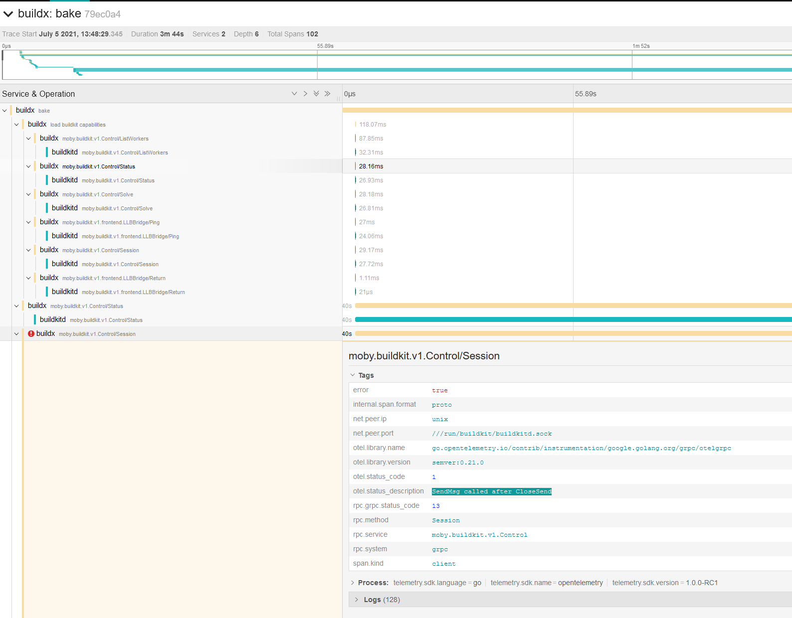

Both Buildx and BuildKit support [OpenTelemetry](https://opentelemetry.io/){:target="blank" rel="noopener" class=""}.

To capture the trace to [Jaeger](https://github.com/jaegertracing/jaeger){:target="blank" rel="noopener" class=""},
set `JAEGER_TRACE` environment variable to the collection address using a
`driver-opt`.

First create a Jaeger container:

```console
$ docker run -d --name jaeger -p "6831:6831/udp" -p "16686:16686" jaegertracing/all-in-one
```

Then [create a `docker-container` builder](../drivers/docker-container.md)
that will use the Jaeger instance via the `JAEGER_TRACE` env var:

```console
$ docker buildx create --use \
  --name mybuilder \
  --driver docker-container \
  --driver-opt "network=host" \
  --driver-opt "env.JAEGER_TRACE=localhost:6831"
```

Boot and [inspect `mybuilder`](../../engine/reference/commandline/buildx_inspect.md):

```console
$ docker buildx inspect --bootstrap
```

Buildx commands should be traced at `http://127.0.0.1:16686/`:


